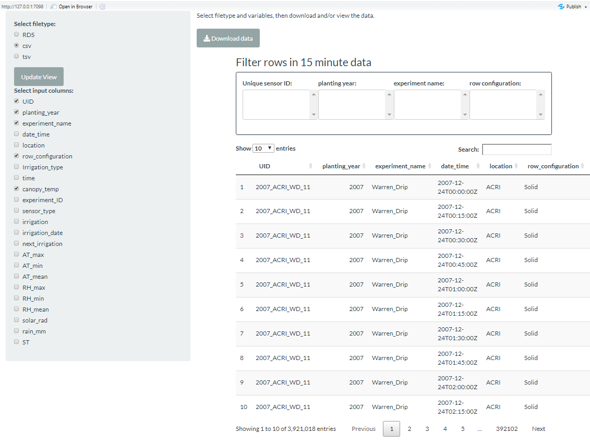

```{r setup, include=FALSE}
knitr::opts_chunk$set(
  results = 'asis',
  echo = FALSE,
  warning = FALSE,
  message = FALSE,
  fig.align = 'center'
)

#Load libraries
library(tidyverse)
library(gapminder)
library(gganimate)
library(kableExtra)
```


# Introduction
I started with CSIRO in Alice Springs and transferred to the cotton research institute in Narrabri NSW in 2015. Prior to Data School I could adapt existing code in R or Python; I was largely self-taught. Currently, I manage field measurements, calibration and repair of canopy temperature senors; I organise and manage data flows, clean and analyse data to calculate canopy temperature stress hours.

# My Synthesis Project
My project aim is to develop an interactive and dynamic tool that can be used to visualise, communicate and demonstrate the impact of changes in biotic parameters on irrigation decisions in cotton. The tool will provide an interactive environment without the user needing to write scripts.
Ultimately we hope to be able to access, download and run routine stress calculations with the data set. 
This project has been a process of discovering what Shiny is capable of, and then adapting my app to various senarios that may be useful.


# My Digital Toolbox
The R language and R Shiny have been my principal tools. Shiny is specifically designed to create interactive web applications using the R language.
Shiny breaks readily, so GitHub and a little Bash have formed an exquisite layer of torture and torments that I am determined to master.
Previously I used R at very much a beginner's level. I had not heard of Shiny, or ever imagined being able to build an interactive web application. Today, I am excited about coding!


## Favourite tool (optional)

R, learing some of the power of R statistics, Shiny, Git Hub.

# My time went ...

Learning Shiny and how to effectively use reactive functions, how to apply a function in R, and how to layout in shiny.
Embarrassingly, the pathways and reading the precursor tables of a large R script that has been developed over the past 2 years was a very challenging hurdle. Having shiny as an interactive tool will add a critical element of reproducibility and accessibility to this particular set of data, as well as the calculations. 


# Next steps

As a result of the work on my synthesis project I am looking forward to developing tools for data dissemination, and seeing where I can take Shiny in terms of functionality and visualization.
I am currently undertaking a statistical analysis experiment report as a result of Dataschool.=
I am looking forward to optimising and automating our teams data checking, cleaning and processing workflows for the coming season. 
I am keen to develop new digital skills in machine learning to large scale thermal imagery in the future.

<br/>
<br/>
<br/>
<br/>


**Select file columns and then select rows, then download or use in Images from a file**
{width=1200}


**Plot to show selected calculated parameters to display**
```{r standard-plot, out.width='100%', fig.align='center', fig.height= 3, fig.width=8}
all_yield_narrow <-  readRDS("Total_DH_and_yield.RDS")

df <- filter(all_yield_narrow, mean_DH > 0)
df %>% 
  filter(mean_DH > 0) %>% 
  ggplot(aes(mean_DH, lint_yield_kg_per_ha, colour = row_configuration)) +
  geom_point() +
 labs(colour = "row configuration",
       x = "average deficit hours between irrigation",
       y = "lint yield kg/ha")+
  theme_linedraw() +
  theme(legend.position = "bottom")
```


**Shiny Application for viewing various parameters for the 15 minute canopy temperature data.**
{width=1200}


# My Data School Experience

The most enjoyable part of Data School for me was the learning environment, the people taking up the challenge of learning new skills together; the experts sharing their knowledge.  
I really enjoyed finally understanding the power of R with respect to statistical analysis.  
The most intruguing part of data school was the machine learning. I am really looking forward to opportunities to develop capability in using these techniques to analyse imagery from new thermal sensors.
The Shiny app will assist with optimising reporting and data flows in our everyday work. It will be a useful tool that is fairly simple to construct, in being able to communicate with our stakeholders. 
I will definately be using the skills I have aquired through data school in my everyday work. The resulting efficiencies will mean that I am working collaboratively to complete statistical analyses and reports for  scientists.  
I am in the process of recruiting to our FAIR data managment support group here.

